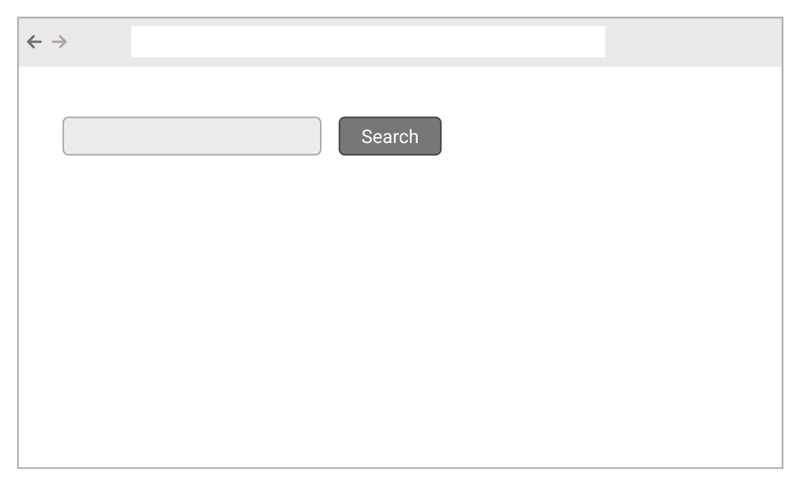
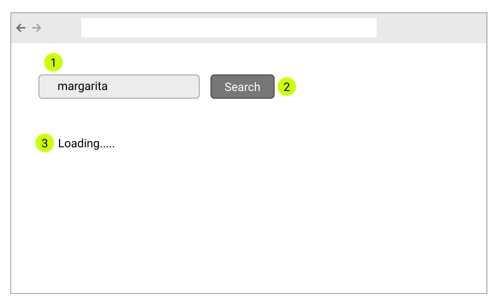
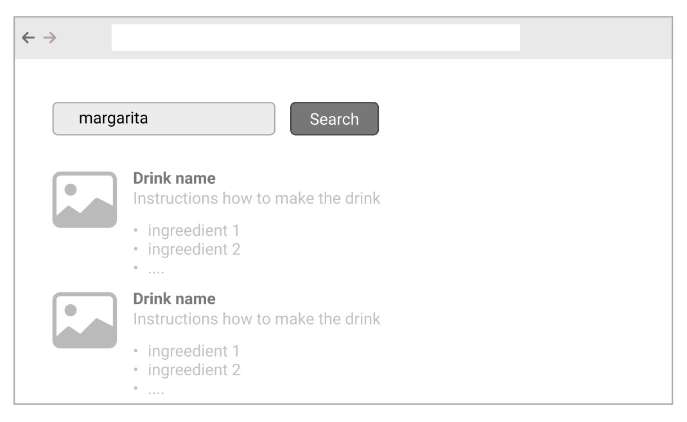

# Coding challenge: Your barkeeper's recipes

You will build a simple recipe search engine for cocktails. You have the following user stories
to explain the basic functionality:

## As a barkeeper ..

I can access my recipes in the browser. I get prompted with an empty search field and a `Search` button.

I can type e.g. `sour` into the search field and click on the `Search` button or hit enter to find all my sour recipes.
I get a search indicator, e.g. ``loading ...`` when the results are fetched.

I get all my sour recipes listed underneath the search field.

## Technical requirements

You should use the [cocktaildb.com API](https://www.thecocktaildb.com/api.php).
Here's an example query for `sour`: `curl https://www.thecocktaildb.com/api/json/v1/1/search.php?s=sour`

### Frameworks

Pick your poison :) We're always interested in funky solutions, but industry standards are what we work with.

### Works for me..

doesn't cut it. Ensure the project isn't only building on your machine.

Bonus: Add a badge displaying project health.

### Tests and documentation

Ideally, you applied TDD and the rest is history, but if you don't find the time to write meaningful tests,
please spend a few minutes thinking about what you would be testing and how. Write it down under
_Discussion_.

Generally, leave the project as tidy as you want the next developer to find it.  

## Evaluation criteria and time

The challenge is meant to give us a feel for how you work and to serve as a starting point for
a follow-up discussion. Completeness is just one factor.

Your time is precious, we don't want you to spend too much time. It should be doable in 2-4h given the right approach 
and tools. Speed is not a criterion.

## Contact

We're here to help and answer questions so do not hesitate to ping us, either using the emails from the first interview 
round or [devs@cwire.com](mailto:devs@cwire.com).

# Discussion

Anything omitted, interesting decisions and criticism go here.
